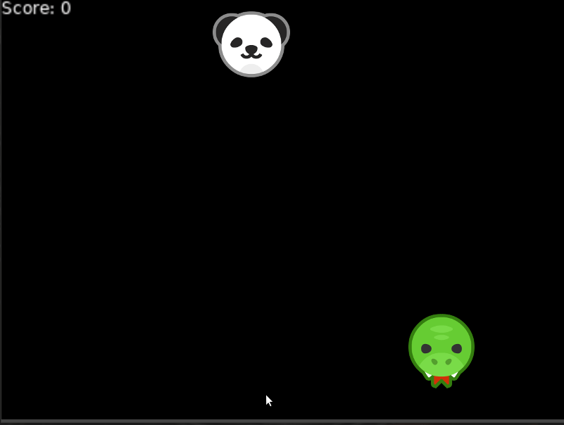

# Shoot The Enemy

A simple game made using Löve.

## Instructions
The goal of the game is to shoot the enemy snake as many times as possible without missing. Missing will reset the game and the score. Every time the enemy is hit, they increase in speed.

## How to run
For windows download the `panda-shooter-windows-version` directory file from the `distribution` directory and run the PandaShooter.exe .
For Linux download the latest version of Löve from [here](https://www.love2d.org/). Then download the PandaShooter.love file from the distribution directory, cd into it and run it with `love .` . 

## Controls
Move your character (the panda) with 'a' and 'd' or with the left and right arrow keys.
Shoot by pressing the spacebar.

## Demo

